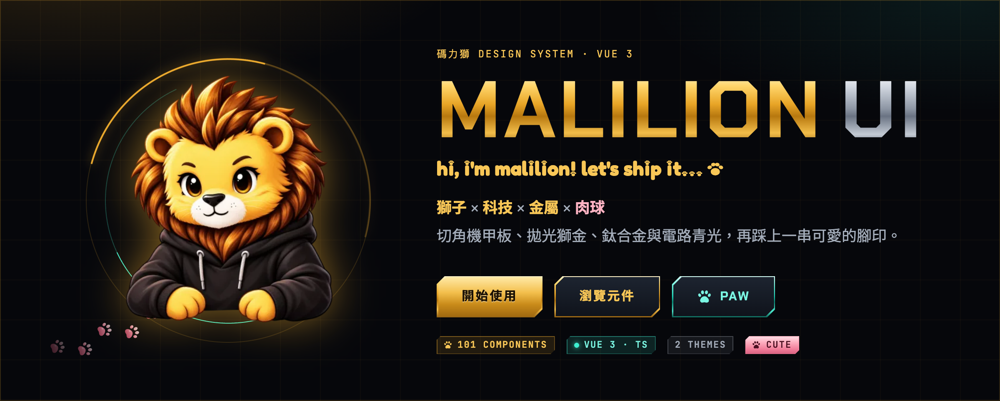
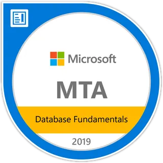

  <a href="https://github.com/malilion/malilion/blob/main/README.md">English</a> · <a href="https://github.com/malilion/malilion/blob/main/README.zh-TW.md">繁體中文</a>

# Hi, I'm MaliLion 🦁

**AI × Code × Game Development**

Turning learning into projects, and projects into a brand.

I build AI experiments, developer tools, interactive games, and learning experiences — then turn the process into reusable notes, open-source projects, and a growing MaliLion ecosystem.

---

## 🚀 Featured Projects

  

  <a href="https://github.com/malilion/MalilionUI"><b>Malilion UI</b></a> — Lion × tech × metal component library with paw prints. 161 components for Vue 3 and React, TypeScript, two themes, Taiwan validators, zero runtime dependencies.
   
  
  
  
   
  <a href="https://malilion.github.io/MalilionUI/"><b>📖 Docs & live demos</b></a> · <a href="https://www.youtube.com/watch?v=ElXvObJbIFY"><b>▶️ Trailer</b></a>

<table>
  <tr>
    <td width="33%" valign="top">
      <h3><a href="https://malilion.com/world">MaliLion 3D World</a></h3>
      
An interactive 3D world built around AI × code × game development.

      
<b>Three.js · TypeScript · Web 3D</b>

    </td>
    <td width="33%" valign="top">
      <h3><a href="https://github.com/malilion/ContextLion">ContextLion</a></h3>
      
A local-first browser extension that turns webpages into clean, structured, AI-ready Markdown context.

      
<b>Browser Extension · AI Context · Local-first</b>

    </td>
    <td width="33%" valign="top">
      <h3><a href="https://ithelp.ithome.com.tw/users/20183394/ironman/9059">九重燼</a></h3>
      
An interactive visual-novel project and technical series exploring narrative systems, rendering, and game architecture.

      
<b>Vue 3 · PixiJS · Ink.js</b>

    </td>
  </tr>
  <tr>
    <td width="33%" valign="top">
      <h3><a href="https://github.com/malilion/devtrace-lion">DevTrace Lion</a></h3>
      
Local-first API debugging inside browser DevTools with zero required permissions.

      
<b>DevTools · API Debugging · Local-first</b>

    </td>
    <td width="33%" valign="top">
      <h3><a href="https://github.com/malilion/The-Nocturne-Atlas">The Nocturne Atlas</a></h3>
      
A seed-driven 3D wizarding world built with Three.js and TypeScript.

      
<b>Three.js · TypeScript · Procedural World</b>

    </td>
    <td width="33%" valign="top">
      <h3><a href="https://malilion.com">MaliLion.com</a></h3>
      
The home of my projects, experiments, build notes, game development, and creator brand.

      
<b>Personal Brand · Projects · Build Notes</b>

    </td>
  </tr>
</table>

## 🔥 Currently Building

- **AI learning experiences** — turning technical topics into interactive learning flows and reusable course content.
- **Developer tools** — small, focused tools that improve AI-assisted coding and browser workflows.
- **Interactive games & worlds** — experiments across narrative games, web 3D, and game systems.
- **The MaliLion ecosystem** — connecting projects, content, open source, and community under one consistent brand.

## 🌱 Open Source

- **[Malilion UI](https://github.com/malilion/MalilionUI)** — A lion × tech × metal component library for Vue 3 and React, published as `@malilion/ui`.
- **[BlockUI](https://malilion.github.io/BlockUI/)** — A block × pixel × crafting game-style React component library with five themes and WCAG 2.2 AA.
- **[lyricreel](https://github.com/malilion/lyricreel)** — Song and lyrics in, beat-synced lyric music video out; every frame drawn in code.
- **[ContextLion](https://github.com/malilion/ContextLion)** — Turn webpages into structured, AI-ready Markdown context.
- **[DevTrace Lion](https://github.com/malilion/devtrace-lion)** — Local-first API debugging directly inside browser DevTools.
- **[The Nocturne Atlas](https://github.com/malilion/The-Nocturne-Atlas)** — A seed-driven 3D wizarding world.
- **[Editorial Photo Poster](https://github.com/malilion/editorial-photo-poster)** — A Codex skill for turning photographs into restrained editorial posters.
- **[Haute Jewelry From Photo](https://github.com/malilion/haute-jewelry-from-photo)** — A Codex skill that translates visual mood and forms into original haute joaillerie concepts.
- **[Scenic Bookmark Travel Poster](https://github.com/malilion/scenic-bookmark-travel-poster)** — A Codex skill for transforming travel photos into Japanese-inspired souvenir poster and bookmark designs.

## 🧰 Tech Stack

<table align="center">
    <tr><td colspan="7" align="center"><b>Languages & Core</b></td></tr>
    <tr>
      <td align="center"></td>
      <td align="center"></td>
      <td align="center"></td>
      <td align="center"></td>
      <td align="center"></td>
      <td align="center"></td>
      <td align="center"></td>
    </tr>
    <tr><td colspan="7" align="center"><b>Frameworks & Frontend</b></td></tr>
    <tr>
      <td align="center"></td>
      <td align="center"></td>
      <td align="center"></td>
      <td align="center"></td>
      <td align="center"></td>
      <td align="center"></td>
      <td align="center"></td>
    </tr>
    <tr><td colspan="7" align="center"><b>Cloud & Data</b></td></tr>
    <tr>
      <td align="center"></td>
      <td align="center"></td>
      <td align="center"></td>
      <td align="center"></td>
      <td align="center"></td>
      <td align="center"></td>
      <td align="center"></td>
    </tr>
    <tr><td colspan="7" align="center"><b>Tools & Interactive</b></td></tr>
    <tr>
      <td align="center"></td>
      <td align="center"></td>
      <td align="center"></td>
      <td align="center"></td>
      <td align="center"></td>
      <td align="center"></td>
      <td align="center"></td>
    </tr>
</table>

  <b>Backend & enterprise systems</b> · .NET / C# / Laravel 
  <b>Frontend & product</b> · Vue / React / TypeScript / Next.js 
  <b>Cloud & platform</b> · AWS / Docker / Cloudflare / Vercel / PostgreSQL / MySQL 
  <b>Interactive development</b> · Three.js / Godot

## 💼 Experience at a Glance

| Period | Role | Focus |
| --- | --- | --- |
| 2023 | Software Engineer · Startup Company | Laravel, MySQL, REST APIs, Docker, enterprise systems |
| 2024—2026 | Software Engineer · Industrial Computer Company | ASP.NET Core, Vue.js, MSSQL / Oracle, architecture, internal platforms |
| 2026—Present | Software Engineer · Technology Company | Vue.js, .NET Core APIs, enterprise applications, architecture and team practices |

> I care most about turning real operational problems into maintainable systems, then carrying what I learn into side projects and open source.

## 🏆 Certifications

  <table>
    <tr>
      <td align="center" width="180"> <b>AWS Certified Cloud Practitioner</b></td>
      <td align="center" width="180"> <b>AWS Certified AI Practitioner</b></td>
      <td align="center" width="180"> <b>MTA Database Fundamentals</b></td>
      <td align="center" width="180"> <b>MTA Networking Fundamentals</b></td>
      <td align="center" width="180"> <b>MTA Software Development Fundamentals</b></td>
    </tr>
  </table>

## 📊 GitHub Activity

  <picture>
    <source media="(prefers-color-scheme: dark)" srcset="https://raw.githubusercontent.com/malilion/malilion/gh-pages/stats-dark.svg">
    <source media="(prefers-color-scheme: light)" srcset="https://raw.githubusercontent.com/malilion/malilion/gh-pages/stats-light.svg">
    
  </picture>

  <picture>
    <source media="(prefers-color-scheme: dark)" srcset="https://raw.githubusercontent.com/malilion/malilion/gh-pages/streak-dark.svg">
    <source media="(prefers-color-scheme: light)" srcset="https://raw.githubusercontent.com/malilion/malilion/gh-pages/streak-light.svg">
    
  </picture>
  <picture>
    <source media="(prefers-color-scheme: dark)" srcset="https://raw.githubusercontent.com/malilion/malilion/gh-pages/languages-dark.svg">
    <source media="(prefers-color-scheme: light)" srcset="https://raw.githubusercontent.com/malilion/malilion/gh-pages/languages-light.svg">
    
  </picture>

  <picture>
    <source media="(prefers-color-scheme: dark)" srcset="https://raw.githubusercontent.com/malilion/malilion/gh-pages/monthly-dark.svg">
    <source media="(prefers-color-scheme: light)" srcset="https://raw.githubusercontent.com/malilion/malilion/gh-pages/monthly-light.svg">
    
  </picture>

  <picture>
    <source media="(prefers-color-scheme: dark)" srcset="https://raw.githubusercontent.com/malilion/malilion/gh-pages/paw-heatmap-dark.svg">
    <source media="(prefers-color-scheme: light)" srcset="https://raw.githubusercontent.com/malilion/malilion/gh-pages/paw-heatmap-light.svg">
    
  </picture>

---

   
  🐾 &nbsp; 🐾 &nbsp; 🐾 
  <b>Build → Learn → Share → Build again.</b> 
  Thanks for stopping by — explore the projects, follow the experiments, or say hi on Threads. 🦁

