

  <a href="https://malilion.com">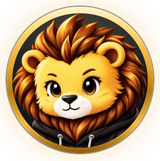</a>&nbsp;
  <a href="https://www.threads.com/@malilion.dev"><picture><source media="(prefers-color-scheme: dark)" srcset="https://cdn.simpleicons.org/threads/F1EDE6"></picture></a>&nbsp;
  <a href="https://github.com/malilion?tab=repositories"><picture><source media="(prefers-color-scheme: dark)" srcset="https://cdn.simpleicons.org/github/F1EDE6"></picture></a>&nbsp;
  <a href="https://www.npmjs.com/package/@malilion/ui"><picture><source media="(prefers-color-scheme: dark)" srcset="https://cdn.simpleicons.org/npm/CB3837"></picture></a>
  &nbsp;&nbsp;|&nbsp;&nbsp;
  <a href="https://github.com/malilion/malilion/blob/main/README.md">English</a> · <a href="https://github.com/malilion/malilion/blob/main/README.zh-TW.md">繁體中文</a>

<a href="https://malilion.com"><picture><source media="(max-width: 600px) and (prefers-color-scheme: dark)" srcset="./assets/brand/bento/hero-m-en-dark.svg"><source media="(max-width: 600px)" srcset="./assets/brand/bento/hero-m-en-light.svg"><source media="(prefers-color-scheme: dark)" srcset="./assets/brand/bento/hero-en-dark.svg"></picture></a> 
<picture><source media="(max-width: 600px) and (prefers-color-scheme: dark)" srcset="./assets/brand/bento/ticker-m-en-dark.svg"><source media="(max-width: 600px)" srcset="./assets/brand/bento/ticker-m-en-light.svg"><source media="(prefers-color-scheme: dark)" srcset="./assets/brand/bento/ticker-en-dark.svg"></picture> 
<a href="https://malilion.github.io/MalilionUI/"><picture><source media="(max-width: 600px) and (prefers-color-scheme: dark)" srcset="./assets/brand/bento/malilion-ui-m-en-dark.svg"><source media="(max-width: 600px)" srcset="./assets/brand/bento/malilion-ui-m-en-light.svg"><source media="(prefers-color-scheme: dark)" srcset="./assets/brand/bento/malilion-ui-en-dark.svg">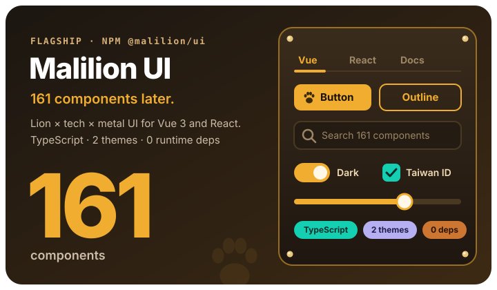</picture></a><!--
--><a href="https://www.malilion.com/world"><picture><source media="(max-width: 600px) and (prefers-color-scheme: dark)" srcset="./assets/brand/bento/project-island-m-en-dark.svg"><source media="(max-width: 600px)" srcset="./assets/brand/bento/project-island-m-en-light.svg"><source media="(prefers-color-scheme: dark)" srcset="./assets/brand/bento/project-island-en-dark.svg"></picture></a> 
<a href="https://github.com/malilion/ContextLion"><picture><source media="(max-width: 600px) and (prefers-color-scheme: dark)" srcset="./assets/brand/bento/contextlion-m-en-dark.svg"><source media="(max-width: 600px)" srcset="./assets/brand/bento/contextlion-m-en-light.svg"><source media="(prefers-color-scheme: dark)" srcset="./assets/brand/bento/contextlion-en-dark.svg"></picture></a><!--
--><a href="https://ithelp.ithome.com.tw/users/20183394/ironman/9059"><picture><source media="(max-width: 600px) and (prefers-color-scheme: dark)" srcset="./assets/brand/bento/ninefold-court-m-en-dark.svg"><source media="(max-width: 600px)" srcset="./assets/brand/bento/ninefold-court-m-en-light.svg"><source media="(prefers-color-scheme: dark)" srcset="./assets/brand/bento/ninefold-court-en-dark.svg"></picture></a><!--
--><a href="https://github.com/malilion/cow-pasture"><picture><source media="(max-width: 600px) and (prefers-color-scheme: dark)" srcset="./assets/brand/bento/cow-pasture-m-en-dark.svg"><source media="(max-width: 600px)" srcset="./assets/brand/bento/cow-pasture-m-en-light.svg"><source media="(prefers-color-scheme: dark)" srcset="./assets/brand/bento/cow-pasture-en-dark.svg">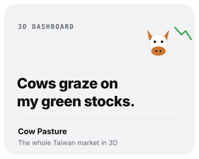</picture></a> 
<a href="https://malilion.com"><picture><source media="(max-width: 600px) and (prefers-color-scheme: dark)" srcset="./assets/brand/bento/now-building-m-en-dark.svg"><source media="(max-width: 600px)" srcset="./assets/brand/bento/now-building-m-en-light.svg"><source media="(prefers-color-scheme: dark)" srcset="./assets/brand/bento/now-building-en-dark.svg"></picture></a><!--
--><a href="https://www.threads.com/@malilion.dev"><picture><source media="(max-width: 600px) and (prefers-color-scheme: dark)" srcset="./assets/brand/bento/threads-m-en-dark.svg"><source media="(max-width: 600px)" srcset="./assets/brand/bento/threads-m-en-light.svg"><source media="(prefers-color-scheme: dark)" srcset="./assets/brand/bento/threads-en-dark.svg"></picture></a>

<a href="https://www.npmjs.com/package/@malilion/ui"><picture><source media="(max-width: 600px)" srcset="https://raw.githubusercontent.com/malilion/malilion/gh-pages/npm-version-m.svg">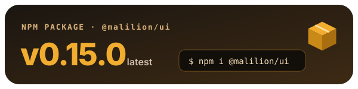</picture></a><!--
--><a href="https://www.npmjs.com/package/@malilion/ui"><picture><source media="(max-width: 600px)" srcset="https://raw.githubusercontent.com/malilion/malilion/gh-pages/npm-downloads-m.svg">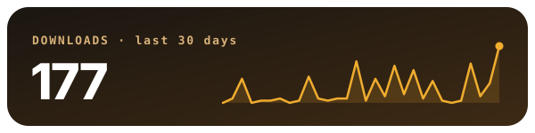</picture></a><!--
--><a href="https://malilion.github.io/MalilionUI/"><picture><source media="(max-width: 600px) and (prefers-color-scheme: dark)" srcset="./assets/brand/bento/ui-docs-m-en-dark.svg"><source media="(max-width: 600px)" srcset="./assets/brand/bento/ui-docs-m-en-light.svg"><source media="(prefers-color-scheme: dark)" srcset="./assets/brand/bento/ui-docs-en-dark.svg"></picture></a><!--
--><a href="https://www.youtube.com/watch?v=ElXvObJbIFY"><picture><source media="(max-width: 600px) and (prefers-color-scheme: dark)" srcset="./assets/brand/bento/ui-trailer-m-en-dark.svg"><source media="(max-width: 600px)" srcset="./assets/brand/bento/ui-trailer-m-en-light.svg"><source media="(prefers-color-scheme: dark)" srcset="./assets/brand/bento/ui-trailer-en-dark.svg">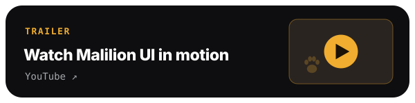</picture></a>

## Explore the MaliLion Universe

<picture><source media="(max-width: 600px) and (prefers-color-scheme: dark)" srcset="./assets/brand/bento/band-ai-tools-m-en-dark.svg"><source media="(max-width: 600px)" srcset="./assets/brand/bento/band-ai-tools-m-en-light.svg"><source media="(prefers-color-scheme: dark)" srcset="./assets/brand/bento/band-ai-tools-en-dark.svg">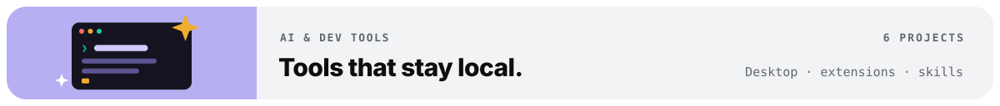</picture> 
<a href="https://malilion.github.io/AURA-REC/"><picture><source media="(max-width: 600px) and (prefers-color-scheme: dark)" srcset="./assets/brand/bento/proj-aura-rec-m-en-dark.svg"><source media="(max-width: 600px)" srcset="./assets/brand/bento/proj-aura-rec-m-en-light.svg"><source media="(prefers-color-scheme: dark)" srcset="./assets/brand/bento/proj-aura-rec-en-dark.svg">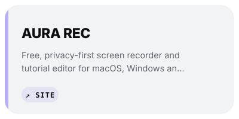</picture></a><!--
--><a href="https://github.com/malilion/StockLion"><picture><source media="(max-width: 600px) and (prefers-color-scheme: dark)" srcset="./assets/brand/bento/proj-stocklion-m-en-dark.svg"><source media="(max-width: 600px)" srcset="./assets/brand/bento/proj-stocklion-m-en-light.svg"><source media="(prefers-color-scheme: dark)" srcset="./assets/brand/bento/proj-stocklion-en-dark.svg">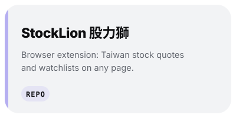</picture></a><!--
--><a href="https://malilion.github.io/Malilion-AI-Radar/"><picture><source media="(max-width: 600px) and (prefers-color-scheme: dark)" srcset="./assets/brand/bento/proj-ai-radar-m-en-dark.svg"><source media="(max-width: 600px)" srcset="./assets/brand/bento/proj-ai-radar-m-en-light.svg"><source media="(prefers-color-scheme: dark)" srcset="./assets/brand/bento/proj-ai-radar-en-dark.svg">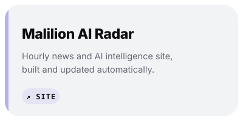</picture></a><!--
--><a href="https://github.com/malilion/DevTraceLion"><picture><source media="(max-width: 600px) and (prefers-color-scheme: dark)" srcset="./assets/brand/bento/proj-devtrace-m-en-dark.svg"><source media="(max-width: 600px)" srcset="./assets/brand/bento/proj-devtrace-m-en-light.svg"><source media="(prefers-color-scheme: dark)" srcset="./assets/brand/bento/proj-devtrace-en-dark.svg">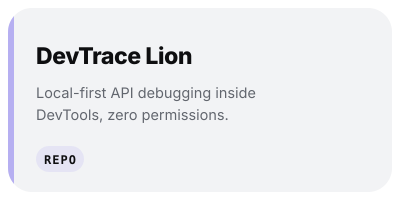</picture></a><!--
--><a href="https://malilion.github.io/github-repo-landing-page-skill/"><picture><source media="(max-width: 600px) and (prefers-color-scheme: dark)" srcset="./assets/brand/bento/proj-landing-skill-m-en-dark.svg"><source media="(max-width: 600px)" srcset="./assets/brand/bento/proj-landing-skill-m-en-light.svg"><source media="(prefers-color-scheme: dark)" srcset="./assets/brand/bento/proj-landing-skill-en-dark.svg">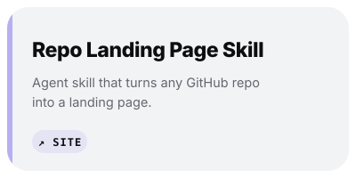</picture></a><!--
--><a href="https://github.com/malilion/editorial-photo-poster"><picture><source media="(max-width: 600px) and (prefers-color-scheme: dark)" srcset="./assets/brand/bento/proj-photo-skills-m-en-dark.svg"><source media="(max-width: 600px)" srcset="./assets/brand/bento/proj-photo-skills-m-en-light.svg"><source media="(prefers-color-scheme: dark)" srcset="./assets/brand/bento/proj-photo-skills-en-dark.svg">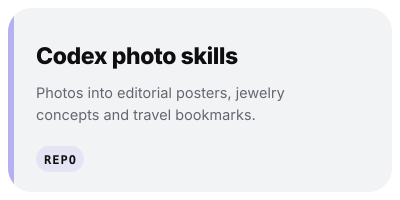</picture></a>

<picture><source media="(max-width: 600px) and (prefers-color-scheme: dark)" srcset="./assets/brand/bento/band-games-m-en-dark.svg"><source media="(max-width: 600px)" srcset="./assets/brand/bento/band-games-m-en-light.svg"><source media="(prefers-color-scheme: dark)" srcset="./assets/brand/bento/band-games-en-dark.svg">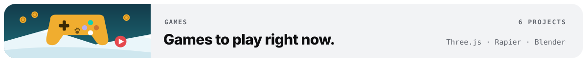</picture> 
<a href="https://malilion.github.io/Snowboarding/"><picture><source media="(max-width: 600px) and (prefers-color-scheme: dark)" srcset="./assets/brand/bento/proj-powder-rush-m-en-dark.svg"><source media="(max-width: 600px)" srcset="./assets/brand/bento/proj-powder-rush-m-en-light.svg"><source media="(prefers-color-scheme: dark)" srcset="./assets/brand/bento/proj-powder-rush-en-dark.svg">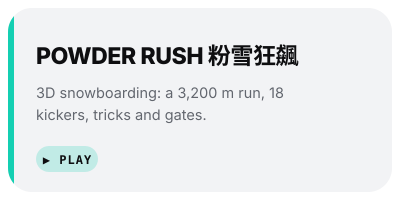</picture></a><!--
--><a href="https://malilion.github.io/neon-taipei-overdrive/"><picture><source media="(max-width: 600px) and (prefers-color-scheme: dark)" srcset="./assets/brand/bento/proj-neon-taipei-m-en-dark.svg"><source media="(max-width: 600px)" srcset="./assets/brand/bento/proj-neon-taipei-m-en-light.svg"><source media="(prefers-color-scheme: dark)" srcset="./assets/brand/bento/proj-neon-taipei-en-dark.svg">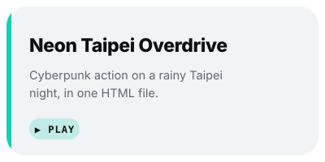</picture></a><!--
--><a href="https://malilion.github.io/shuangyue-wenjian/"><picture><source media="(max-width: 600px) and (prefers-color-scheme: dark)" srcset="./assets/brand/bento/proj-shuangyue-m-en-dark.svg"><source media="(max-width: 600px)" srcset="./assets/brand/bento/proj-shuangyue-m-en-light.svg"><source media="(prefers-color-scheme: dark)" srcset="./assets/brand/bento/proj-shuangyue-en-dark.svg">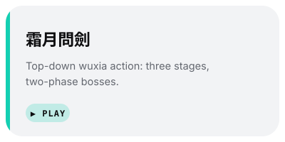</picture></a><!--
--><a href="https://malilion.github.io/prachute/"><picture><source media="(max-width: 600px) and (prefers-color-scheme: dark)" srcset="./assets/brand/bento/proj-cloud-dive-m-en-dark.svg"><source media="(max-width: 600px)" srcset="./assets/brand/bento/proj-cloud-dive-m-en-light.svg"><source media="(prefers-color-scheme: dark)" srcset="./assets/brand/bento/proj-cloud-dive-en-dark.svg">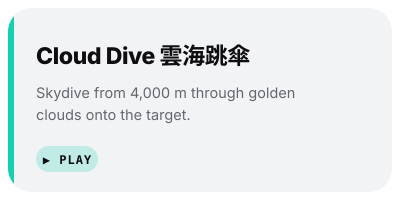</picture></a><!--
--><a href="https://malilion.github.io/star-garden-rumble/"><picture><source media="(max-width: 600px) and (prefers-color-scheme: dark)" srcset="./assets/brand/bento/proj-star-garden-m-en-dark.svg"><source media="(max-width: 600px)" srcset="./assets/brand/bento/proj-star-garden-m-en-light.svg"><source media="(prefers-color-scheme: dark)" srcset="./assets/brand/bento/proj-star-garden-en-dark.svg">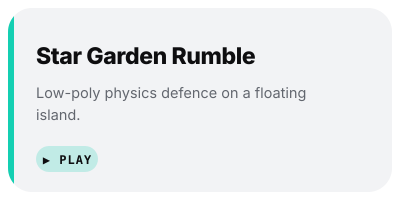</picture></a><!--
--><a href="https://malilion.github.io/Polar-Bear-BBQ-Game/"><picture><source media="(max-width: 600px) and (prefers-color-scheme: dark)" srcset="./assets/brand/bento/proj-polar-bbq-m-en-dark.svg"><source media="(max-width: 600px)" srcset="./assets/brand/bento/proj-polar-bbq-m-en-light.svg"><source media="(prefers-color-scheme: dark)" srcset="./assets/brand/bento/proj-polar-bbq-en-dark.svg">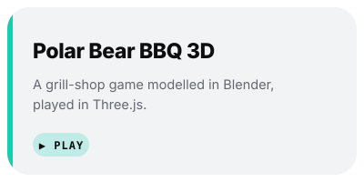</picture></a>

<picture><source media="(max-width: 600px) and (prefers-color-scheme: dark)" srcset="./assets/brand/bento/band-worlds-m-en-dark.svg"><source media="(max-width: 600px)" srcset="./assets/brand/bento/band-worlds-m-en-light.svg"><source media="(prefers-color-scheme: dark)" srcset="./assets/brand/bento/band-worlds-en-dark.svg">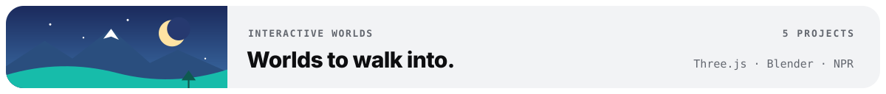</picture> 
<a href="https://malilion.github.io/The-Nocturne-Atlas/"><picture><source media="(max-width: 600px) and (prefers-color-scheme: dark)" srcset="./assets/brand/bento/proj-nocturne-m-en-dark.svg"><source media="(max-width: 600px)" srcset="./assets/brand/bento/proj-nocturne-m-en-light.svg"><source media="(prefers-color-scheme: dark)" srcset="./assets/brand/bento/proj-nocturne-en-dark.svg">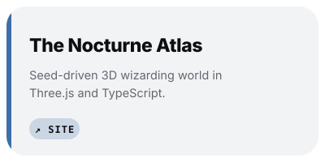</picture></a><!--
--><a href="https://malilion.github.io/Painterly-Meadow/"><picture><source media="(max-width: 600px) and (prefers-color-scheme: dark)" srcset="./assets/brand/bento/proj-meadow-m-en-dark.svg"><source media="(max-width: 600px)" srcset="./assets/brand/bento/proj-meadow-m-en-light.svg"><source media="(prefers-color-scheme: dark)" srcset="./assets/brand/bento/proj-meadow-en-dark.svg">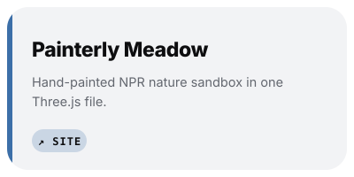</picture></a><!--
--><a href="https://malilion.github.io/fuji-sakura-vista/"><picture><source media="(max-width: 600px) and (prefers-color-scheme: dark)" srcset="./assets/brand/bento/proj-fuji-m-en-dark.svg"><source media="(max-width: 600px)" srcset="./assets/brand/bento/proj-fuji-m-en-light.svg"><source media="(prefers-color-scheme: dark)" srcset="./assets/brand/bento/proj-fuji-en-dark.svg">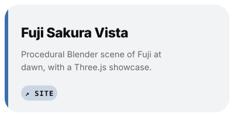</picture></a><!--
--><a href="https://malilion.github.io/bee_scene/"><picture><source media="(max-width: 600px) and (prefers-color-scheme: dark)" srcset="./assets/brand/bento/proj-bee-m-en-dark.svg"><source media="(max-width: 600px)" srcset="./assets/brand/bento/proj-bee-m-en-light.svg"><source media="(prefers-color-scheme: dark)" srcset="./assets/brand/bento/proj-bee-en-dark.svg">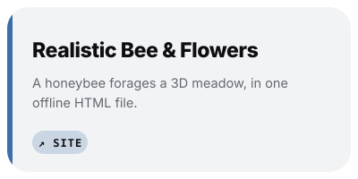</picture></a><!--
--><a href="https://malilion.github.io/my-bear-jelly/"><picture><source media="(max-width: 600px) and (prefers-color-scheme: dark)" srcset="./assets/brand/bento/proj-gummy-m-en-dark.svg"><source media="(max-width: 600px)" srcset="./assets/brand/bento/proj-gummy-m-en-light.svg"><source media="(prefers-color-scheme: dark)" srcset="./assets/brand/bento/proj-gummy-en-dark.svg">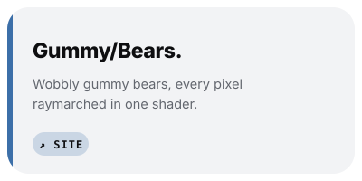</picture></a><!--
--><a href="https://github.com/malilion?tab=repositories"><picture><source media="(max-width: 600px) and (prefers-color-scheme: dark)" srcset="./assets/brand/bento/proj-all-repos-m-en-dark.svg"><source media="(max-width: 600px)" srcset="./assets/brand/bento/proj-all-repos-m-en-light.svg"><source media="(prefers-color-scheme: dark)" srcset="./assets/brand/bento/proj-all-repos-en-dark.svg">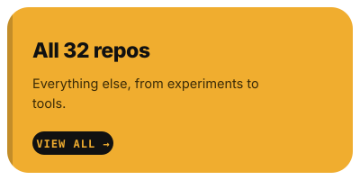</picture></a>

<picture><source media="(max-width: 600px) and (prefers-color-scheme: dark)" srcset="./assets/brand/bento/band-creative-m-en-dark.svg"><source media="(max-width: 600px)" srcset="./assets/brand/bento/band-creative-m-en-light.svg"><source media="(prefers-color-scheme: dark)" srcset="./assets/brand/bento/band-creative-en-dark.svg">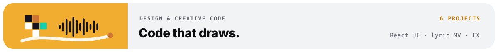</picture> 
<a href="https://malilion.github.io/BlockUI/"><picture><source media="(max-width: 600px) and (prefers-color-scheme: dark)" srcset="./assets/brand/bento/proj-blockui-m-en-dark.svg"><source media="(max-width: 600px)" srcset="./assets/brand/bento/proj-blockui-m-en-light.svg"><source media="(prefers-color-scheme: dark)" srcset="./assets/brand/bento/proj-blockui-en-dark.svg">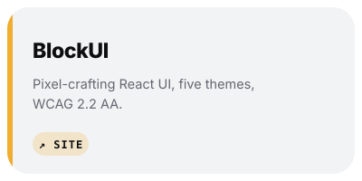</picture></a><!--
--><a href="https://github.com/malilion/lyricreel"><picture><source media="(max-width: 600px) and (prefers-color-scheme: dark)" srcset="./assets/brand/bento/proj-lyricreel-m-en-dark.svg"><source media="(max-width: 600px)" srcset="./assets/brand/bento/proj-lyricreel-m-en-light.svg"><source media="(prefers-color-scheme: dark)" srcset="./assets/brand/bento/proj-lyricreel-en-dark.svg">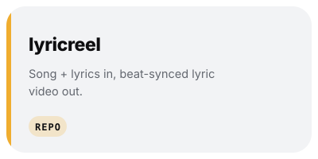</picture></a><!--
--><a href="https://github.com/malilion/riso-mv-kit"><picture><source media="(max-width: 600px) and (prefers-color-scheme: dark)" srcset="./assets/brand/bento/proj-riso-m-en-dark.svg"><source media="(max-width: 600px)" srcset="./assets/brand/bento/proj-riso-m-en-light.svg"><source media="(prefers-color-scheme: dark)" srcset="./assets/brand/bento/proj-riso-en-dark.svg">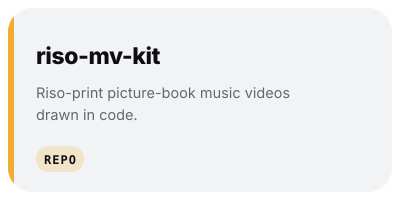</picture></a><!--
--><a href="https://malilion.github.io/inkfx/"><picture><source media="(max-width: 600px) and (prefers-color-scheme: dark)" srcset="./assets/brand/bento/proj-inkfx-m-en-dark.svg"><source media="(max-width: 600px)" srcset="./assets/brand/bento/proj-inkfx-m-en-light.svg"><source media="(prefers-color-scheme: dark)" srcset="./assets/brand/bento/proj-inkfx-en-dark.svg">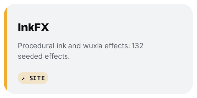</picture></a><!--
--><a href="https://malilion.github.io/oledfx/"><picture><source media="(max-width: 600px) and (prefers-color-scheme: dark)" srcset="./assets/brand/bento/proj-oledfx-m-en-dark.svg"><source media="(max-width: 600px)" srcset="./assets/brand/bento/proj-oledfx-m-en-light.svg"><source media="(prefers-color-scheme: dark)" srcset="./assets/brand/bento/proj-oledfx-en-dark.svg">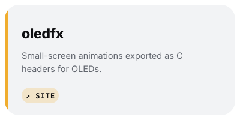</picture></a><!--
--><a href="https://malilion.github.io/fx-skill-kit/"><picture><source media="(max-width: 600px) and (prefers-color-scheme: dark)" srcset="./assets/brand/bento/proj-fx-skill-kit-m-en-dark.svg"><source media="(max-width: 600px)" srcset="./assets/brand/bento/proj-fx-skill-kit-m-en-light.svg"><source media="(prefers-color-scheme: dark)" srcset="./assets/brand/bento/proj-fx-skill-kit-en-dark.svg">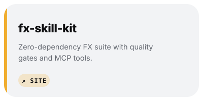</picture></a>

## Stack

<picture><source media="(max-width: 600px) and (prefers-color-scheme: dark)" srcset="./assets/brand/bento/stack-core-m-en-dark.svg"><source media="(max-width: 600px)" srcset="./assets/brand/bento/stack-core-m-en-light.svg"><source media="(prefers-color-scheme: dark)" srcset="./assets/brand/bento/stack-core-en-dark.svg"></picture><!--
--><picture><source media="(max-width: 600px) and (prefers-color-scheme: dark)" srcset="./assets/brand/bento/stack-frontend-m-en-dark.svg"><source media="(max-width: 600px)" srcset="./assets/brand/bento/stack-frontend-m-en-light.svg"><source media="(prefers-color-scheme: dark)" srcset="./assets/brand/bento/stack-frontend-en-dark.svg">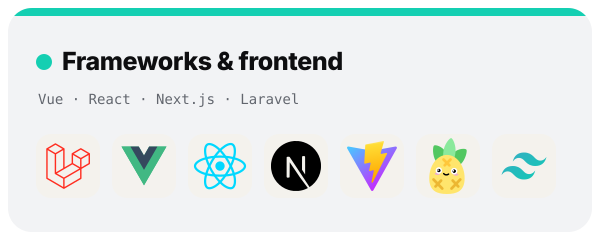</picture><!--
--><picture><source media="(max-width: 600px) and (prefers-color-scheme: dark)" srcset="./assets/brand/bento/stack-cloud-m-en-dark.svg"><source media="(max-width: 600px)" srcset="./assets/brand/bento/stack-cloud-m-en-light.svg"><source media="(prefers-color-scheme: dark)" srcset="./assets/brand/bento/stack-cloud-en-dark.svg"></picture><!--
--><picture><source media="(max-width: 600px) and (prefers-color-scheme: dark)" srcset="./assets/brand/bento/stack-tools-m-en-dark.svg"><source media="(max-width: 600px)" srcset="./assets/brand/bento/stack-tools-m-en-light.svg"><source media="(prefers-color-scheme: dark)" srcset="./assets/brand/bento/stack-tools-en-dark.svg">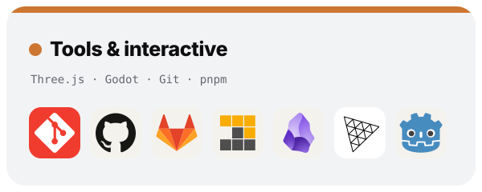</picture>

## Experience

<picture><source media="(max-width: 600px) and (prefers-color-scheme: dark)" srcset="./assets/brand/bento/role-1-m-en-dark.svg"><source media="(max-width: 600px)" srcset="./assets/brand/bento/role-1-m-en-light.svg"><source media="(prefers-color-scheme: dark)" srcset="./assets/brand/bento/role-1-en-dark.svg">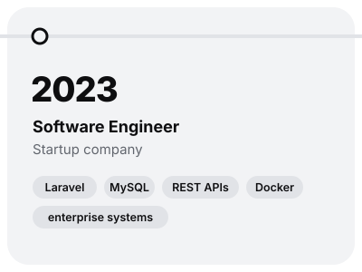</picture><!--
--><picture><source media="(max-width: 600px) and (prefers-color-scheme: dark)" srcset="./assets/brand/bento/role-2-m-en-dark.svg"><source media="(max-width: 600px)" srcset="./assets/brand/bento/role-2-m-en-light.svg"><source media="(prefers-color-scheme: dark)" srcset="./assets/brand/bento/role-2-en-dark.svg">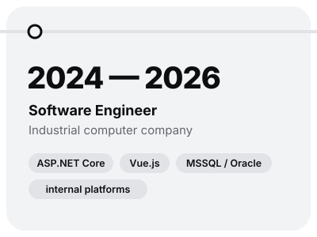</picture><!--
--><picture><source media="(max-width: 600px) and (prefers-color-scheme: dark)" srcset="./assets/brand/bento/role-3-m-en-dark.svg"><source media="(max-width: 600px)" srcset="./assets/brand/bento/role-3-m-en-light.svg"><source media="(prefers-color-scheme: dark)" srcset="./assets/brand/bento/role-3-en-dark.svg">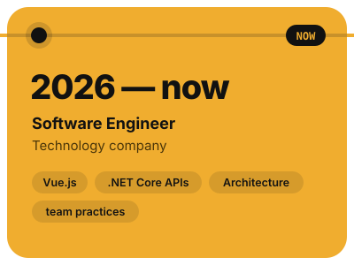</picture><!--
--><picture><source media="(max-width: 600px) and (prefers-color-scheme: dark)" srcset="./assets/brand/bento/exp-quote-m-en-dark.svg"><source media="(max-width: 600px)" srcset="./assets/brand/bento/exp-quote-m-en-light.svg"><source media="(prefers-color-scheme: dark)" srcset="./assets/brand/bento/exp-quote-en-dark.svg">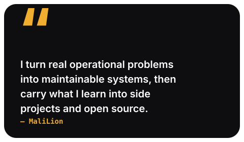</picture><!--
--><picture><source media="(max-width: 600px) and (prefers-color-scheme: dark)" srcset="./assets/brand/bento/certs-m-en-dark.svg"><source media="(max-width: 600px)" srcset="./assets/brand/bento/certs-m-en-light.svg"><source media="(prefers-color-scheme: dark)" srcset="./assets/brand/bento/certs-en-dark.svg">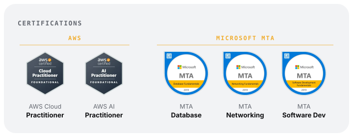</picture>

## Activity

<picture><source media="(max-width: 600px) and (prefers-color-scheme: dark)" srcset="https://raw.githubusercontent.com/malilion/malilion/gh-pages/activity-pulse-m-dark.svg"><source media="(max-width: 600px)" srcset="https://raw.githubusercontent.com/malilion/malilion/gh-pages/activity-pulse-m-light.svg"><source media="(prefers-color-scheme: dark)" srcset="https://raw.githubusercontent.com/malilion/malilion/gh-pages/activity-pulse-dark.svg">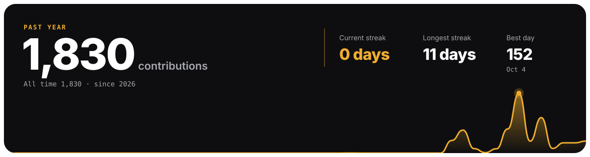</picture><!--
--><picture><source media="(max-width: 600px) and (prefers-color-scheme: dark)" srcset="https://raw.githubusercontent.com/malilion/malilion/gh-pages/activity-languages-m-dark.svg"><source media="(max-width: 600px)" srcset="https://raw.githubusercontent.com/malilion/malilion/gh-pages/activity-languages-m-light.svg"><source media="(prefers-color-scheme: dark)" srcset="https://raw.githubusercontent.com/malilion/malilion/gh-pages/activity-languages-dark.svg"></picture><!--
--><picture><source media="(max-width: 600px) and (prefers-color-scheme: dark)" srcset="https://raw.githubusercontent.com/malilion/malilion/gh-pages/activity-shipped-m-dark.svg"><source media="(max-width: 600px)" srcset="https://raw.githubusercontent.com/malilion/malilion/gh-pages/activity-shipped-m-light.svg"><source media="(prefers-color-scheme: dark)" srcset="https://raw.githubusercontent.com/malilion/malilion/gh-pages/activity-shipped-dark.svg">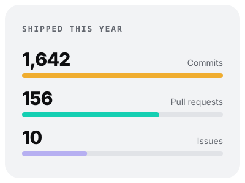</picture><!--
--><picture><source media="(max-width: 600px) and (prefers-color-scheme: dark)" srcset="https://raw.githubusercontent.com/malilion/malilion/gh-pages/activity-community-m-dark.svg"><source media="(max-width: 600px)" srcset="https://raw.githubusercontent.com/malilion/malilion/gh-pages/activity-community-m-light.svg"><source media="(prefers-color-scheme: dark)" srcset="https://raw.githubusercontent.com/malilion/malilion/gh-pages/activity-community-dark.svg">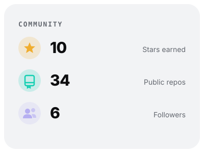</picture>

  <picture>
    <source media="(prefers-color-scheme: dark)" srcset="https://raw.githubusercontent.com/malilion/malilion/gh-pages/paw-heatmap-dark.svg">
    <source media="(prefers-color-scheme: light)" srcset="https://raw.githubusercontent.com/malilion/malilion/gh-pages/paw-heatmap-light.svg">
    
  </picture>

<a href="https://malilion.com"><picture><source media="(max-width: 600px) and (prefers-color-scheme: dark)" srcset="./assets/brand/bento/foot-loop-m-en-dark.svg"><source media="(max-width: 600px)" srcset="./assets/brand/bento/foot-loop-m-en-light.svg"><source media="(prefers-color-scheme: dark)" srcset="./assets/brand/bento/foot-loop-en-dark.svg">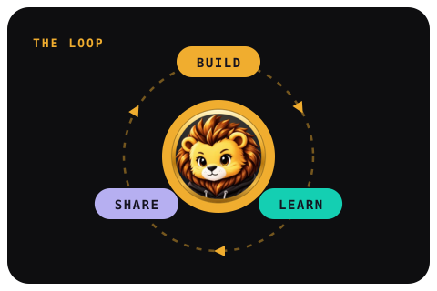</picture></a><!--
--><a href="https://www.threads.com/@malilion.dev"><picture><source media="(max-width: 600px) and (prefers-color-scheme: dark)" srcset="./assets/brand/bento/foot-sign-m-en-dark.svg"><source media="(max-width: 600px)" srcset="./assets/brand/bento/foot-sign-m-en-light.svg"><source media="(prefers-color-scheme: dark)" srcset="./assets/brand/bento/foot-sign-en-dark.svg">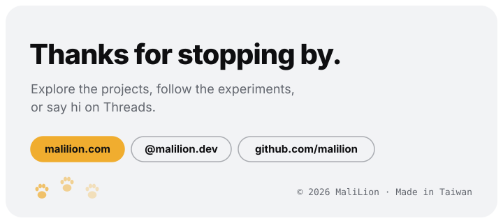</picture></a>

