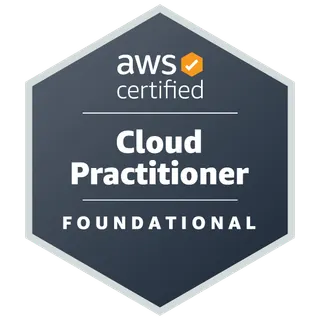
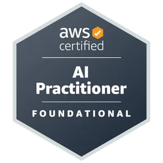
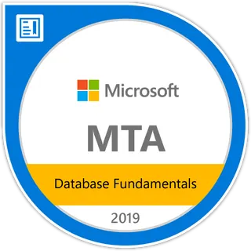

  <a href="https://github.com/malilion/malilion/blob/main/README.md">English</a> · <a href="https://github.com/malilion/malilion/blob/main/README.zh-TW.md">繁體中文</a>

# 嗨，我是碼力獅 MaliLion 🦁

**AI × 程式 × 遊戲開發**

把學習做成作品，把作品做成品牌。

我持續把 AI 實驗、開發工具、互動遊戲與學習內容做成真正可使用的作品，再把開發過程整理成筆記、開源專案與逐步擴大的 MaliLion 生態系。

---

## 🚀 精選作品

<table>
  <tr>
    <td width="33%" valign="top">
      <h3><a href="https://malilion.com/world">MaliLion 3D World</a></h3>
      
以 AI × 程式 × 遊戲開發為核心打造的互動式 3D 世界。

      
<b>Three.js · TypeScript · Web 3D</b>

    </td>
    <td width="33%" valign="top">
      <h3><a href="https://github.com/malilion/ContextLion">ContextLion</a></h3>
      
Local-first 瀏覽器擴充功能，一鍵把網頁整理成乾淨、結構化、適合 AI 使用的 Markdown。

      
<b>Browser Extension · AI Context · Local-first</b>

    </td>
    <td width="33%" valign="top">
      <h3><a href="https://ithelp.ithome.com.tw/users/20183394/ironman/9059">九重燼</a></h3>
      
互動小說作品與技術系列，實作敘事系統、畫面渲染與遊戲架構。

      
<b>Vue 3 · PixiJS · Ink.js</b>

    </td>
  </tr>
  <tr>
    <td width="33%" valign="top">
      <h3><a href="https://github.com/malilion/devtrace-lion">DevTrace Lion</a></h3>
      
直接在瀏覽器 DevTools 內進行 Local-first API 除錯，且不要求額外權限。

      
<b>DevTools · API Debugging · Local-first</b>

    </td>
    <td width="33%" valign="top">
      <h3><a href="https://github.com/malilion/The-Nocturne-Atlas">The Nocturne Atlas</a></h3>
      
使用 Three.js 與 TypeScript 打造、由種子驅動的 3D 魔法世界。

      
<b>Three.js · TypeScript · Procedural World</b>

    </td>
    <td width="33%" valign="top">
      <h3><a href="https://malilion.com">MaliLion.com</a></h3>
      
整合專案、AI 實驗、開發筆記、遊戲開發與個人品牌的核心網站。

      
<b>Personal Brand · Projects · Build Notes</b>

    </td>
  </tr>
</table>

## 🔥 最近在做什麼

- **AI 學習體驗** — 把技術主題轉成互動式學習流程與可持續擴充的課程內容。
- **開發者工具** — 製作小而專注、能改善 AI Coding 與瀏覽器工作流程的工具。
- **互動遊戲與世界** — 持續實驗敘事遊戲、Web 3D 與各種遊戲系統。
- **MaliLion 生態系** — 將作品、內容、開源專案與社群逐步整合成一致的碼力獅品牌。

## 🌱 開源專案

- **[ContextLion](https://github.com/malilion/ContextLion)** — 將網頁內容轉成結構化、AI-ready 的 Markdown。
- **[DevTrace Lion](https://github.com/malilion/devtrace-lion)** — 直接在瀏覽器 DevTools 內進行 Local-first API 除錯。
- **[The Nocturne Atlas](https://github.com/malilion/The-Nocturne-Atlas)** — 由種子驅動的 3D 魔法世界。
- **[Editorial Photo Poster](https://github.com/malilion/editorial-photo-poster)** — 將照片轉化為簡約編輯風海報與手繪場景插畫的 Codex skill。
- **[Haute Jewelry From Photo](https://github.com/malilion/haute-jewelry-from-photo)** — 把圖片氛圍、材質與造型轉譯為原創高級珠寶概念的 Codex skill。
- **[Scenic Bookmark Travel Poster](https://github.com/malilion/scenic-bookmark-travel-poster)** — 將旅遊照片轉化為日系紀念海報與書籤設計的 Codex skill。

## 🧰 技術棧

  <table>
    <tr>
      <td align="center"></td>
      <td align="center"></td>
      <td align="center"></td>
      <td align="center"></td>
      <td align="center"></td>
      <td align="center"></td>
      <td align="center"></td>
      <td align="center"></td>
      <td align="center"></td>
    </tr>
    <tr>
      <td align="center"></td>
      <td align="center"></td>
      <td align="center"></td>
      <td align="center"></td>
      <td align="center"></td>
      <td align="center"></td>
      <td align="center"></td>
      <td align="center"></td>
    </tr>
    <tr>
      <td align="center"></td>
      <td align="center"></td>
      <td align="center"></td>
      <td align="center"></td>
      <td align="center"></td>
      <td align="center"></td>
      <td align="center"></td>
      <td align="center"></td>
      <td align="center"></td>
      <td align="center"></td>
      <td align="center"></td>
      <td align="center"></td>
      <td align="center"></td>
    </tr>
  </table>

  <b>後端與企業系統</b> · .NET / C# / Laravel 
  <b>前端與產品開發</b> · Vue / React / TypeScript / Next.js 
  <b>雲端與平台</b> · AWS / Docker / Cloudflare / Vercel / PostgreSQL / MySQL 
  <b>互動式開發</b> · Three.js / Godot

## 💼 工作經歷速覽

| 時間 | 角色 | 主要方向 |
| --- | --- | --- |
| 2023 | 軟體工程師 · 新創公司 | Laravel、MySQL、REST API、Docker、企業內部系統 |
| 2024～2026 | 軟體工程師 · 工業電腦公司 | ASP.NET Core、Vue.js、MSSQL / Oracle、系統架構、內部平台 |
| 2026～現在 | 軟體工程師 · 科技業 | Vue.js、.NET Core API、企業應用、系統架構與團隊開發規範 |

> 我最在意的是把真實營運問題轉成可維護的系統，再把工作中學到的東西延伸到 Side Project 與開源作品。

## 🏆 證照

  <table>
    <tr>
      <td align="center" width="180"> <b>AWS Certified Cloud Practitioner</b></td>
      <td align="center" width="180"> <b>AWS Certified AI Practitioner</b></td>
      <td align="center" width="180"> <b>MTA Database Fundamentals</b></td>
      <td align="center" width="180"> <b>MTA Networking Fundamentals</b></td>
      <td align="center" width="180"> <b>MTA Software Development Fundamentals</b></td>
    </tr>
  </table>

## 📊 GitHub 活動

  

  <picture>
    <source media="(prefers-color-scheme: dark)" srcset="https://raw.githubusercontent.com/malilion/malilion/gh-pages/github-contribution-grid-snake-dark.svg">
    <source media="(prefers-color-scheme: light)" srcset="https://raw.githubusercontent.com/malilion/malilion/gh-pages/github-contribution-grid-snake.svg">
    
  </picture>

---

  <b>Build → Learn → Share → Build again.</b> 
  謝謝來訪，歡迎逛逛作品、追蹤實驗紀錄，或到 Threads 找我聊聊。🦁

